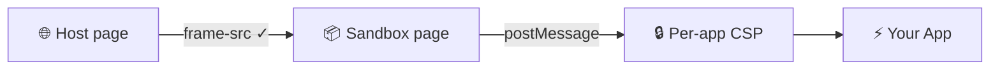

# Why MCP & ChatGPT Apps Use [Double Iframes]{.accent}

### And What That Means for Your App

<div class="speaker-info mt-8">
  
  <div>
    <p class="font-semibold text-base">Frédéric Barthelet</p>
    <p class="text-sm opacity-50">Co-founder @ Alpic</p>
  </div>
</div>

<!--
Hi everyone! I'm Frederic, co-founder at Alpic — we build infrastructure for AI apps. Today we're going deep on something every AI app developer bumps into: the double iframe architecture. Why it exists, what it protects, and what new features it's about to unlock.
-->

---

# What are [AI apps]{.accent}?

<div class="mt-6 flex items-center gap-12">
  <div>
    <ul class="space-y-3 text-lg">
      <li><span class="accent font-semibold">Discoverability</span> in-chat and in stores on ChatGPT and Claude</li>
      <li><span class="accent font-semibold">Interactive UI</span> inside AI chats</li>
      <li>
        <ul class="ml-6 space-y-2">
          <li>Liad and Ido experimenting with <span class="highlight font-semibold">MCP-UI</span></li>
          <li>Initially released on ChatGPT as <span class="highlight font-semibold">OpenAI's Apps SDK</span></li>
          <li>Standardized as <span class="highlight font-semibold">MCP</span> first official extension</li>
        </ul>
      </li>
    </ul>
  </div>
  <div>
    <!-- TODO: placeholder — screenshot of a ChatGPT app rendering inside the chat (e.g. a weather widget or map) -->
    <div class="card flex items-center justify-center" style="width: 320px; height: 200px;">
      <p class="text-xs opacity-30 text-center">📷 Screenshot: AI app rendering inside ChatGPT chat</p>
    </div>
  </div>
</div>

<!--
Quick recap. AI apps are interactive UIs rendered directly inside AI chats. Built on MCP, available on ChatGPT, Claude, Goose, VSCode, Postman, and more. Your app's UI is a web page inside an iframe — but a very specific kind of iframe.
-->

---

# How it [works]{.accent}

<div class="grid grid-cols-[1fr_1.6fr] gap-8 mt-4">
<div class="flex flex-col justify-center space-y-6">
  <div>
    <p class="text-base font-semibold highlight">Views render in response to tool calls</p>
  </div>
  <div>
    <p class="text-base font-semibold highlight">HTML documents live in resources</p>
  </div>
  <div>
    <p class="text-base font-semibold highlight">Views can be cached ahead of time</p>
  </div>
</div>
<div>

```mermaid {scale: 0.72, theme: 'base', themeVariables: {actorTextColor: '#ffffff', actorLineColor: '#ffffff', signalColor: '#ffffff', signalTextColor: '#ffffff', labelTextColor: '#ffffff', noteBkgColor: '#333333', noteTextColor: '#ffffff', sequenceNumberColor: '#ffffff', actorBorder: '#ffffff', actorBkg: '#1a1a2e'}}
sequenceDiagram
  participant H as 🌐 Host
  participant S as ⚙️ MCP Server

  H->>S: tools/list
  S-->>H: tools with _meta.ui.resourceUri
  loop
    H->>+S: tools/call
    H->>S: resources/read
    S-->>H: View HTML with _meta.ui { csp permissions }
    Note over H: Create view in the chat<br/> with iframe
    S-->>-H: result { content + _meta.ui.url }
    Note over H: Hydrate view with tool response
  end
```

</div>
</div>

<!--
Here's how the UI flow works. First, the host discovers your tools via tools/list. The response already includes _meta.ui metadata — CSP directives, permissions — so the host knows before it even invokes the tool that it will render a view. It can prepare the security policies upfront. Then when the host calls the tool, the server returns the result with a _meta.ui.url pointing to the app's HTML. The host creates a sandboxed iframe with the right policies already in place and renders the UI directly in the chat. That iframe setup is where all the security architecture we're about to explore comes into play.

If ui.resourceUri is present and host supports MCP Apps, host renders tool results using the specified UI resource. If host does not support MCP Apps, tool behaves as standard tool (text-only fallback)


-->

---

# Zooming into the [View]{.accent}

<div class="card mt-6 font-['Roboto_Mono'] text-[0.7em] leading-[1.8] w-max mx-auto">
  <p><span class="opacity-40">&lt;body&gt;</span> <span class="opacity-50 highlight">chatgpt.com</span></p>
  <p class="ml-4"><span class="accent">&lt;iframe</span> <span class="opacity-50">src="<span class="highlight">abc123.web-sandbox.oaiusercontent.com</span>"&gt;</span></p>
  <p class="ml-8"><span class="accent">&lt;iframe</span> <span class="opacity-50">src="about:blank"&gt;</span></p>
  <p class="ml-12"><span class="opacity-60">&lt;div&gt; Your App &lt;/div&gt;</span></p>
  <p class="ml-8"><span class="accent">&lt;/iframe&gt;</span></p>
  <p class="ml-4"><span class="accent">&lt;/iframe&gt;</span></p>
  <p><span class="opacity-40">&lt;/body&gt;</span></p>
</div>

<p class="text-2xl mt-8 text-center font-semibold">Why <span class="accent">two</span> iframes?</p>

<!--
Open DevTools on any ChatGPT app and here's what you'll see. The host page at chatgpt.com. Inside, an outer iframe pointing to web-sandbox.oaiusercontent.com — with sandbox attributes. Inside that, an inner iframe with your actual app HTML and an allow attribute for permissions. Two nested iframes. Why? Let's find out.
-->

---

# Before AI Apps — [the host page]{.accent}

<div class="grid grid-cols-[1fr_1.4fr] gap-6 mt-2">
<div>

<div class="card py-2 px-3 font-['Roboto_Mono'] text-[0.7em] w-max leading-[1.5]">
  <p><span class="text-[1.1em] accent font-semibold mb-1">chatgpt.com</span> Content-Security-Policy</p>
  <p>default-src <span class="accent">'self'</span></p>
  <p>script-src <span class="accent">'nonce-…' https://*.chatgpt.com</span></p>
  <p>style-src <span class="accent">'self' 'unsafe-inline'</span></p>
  <p>connect-src <span class="accent">'self' *.openai.com wss://*.chatgpt.com</span></p>
  <p>img-src <span class="accent">'self' * blob: data: https:</span></p>
  <p>frame-src <span class="accent">'self' *.stripe.com *.youtube.com …</span></p>
</div>

</div>
<div>

| Directive   | Allowed values                                                            |
| ----------- | ------------------------------------------------------------------------- |
| default-src | `'none'` `'self'` `https:`                                                |
| script-src  | `'none'` `'nonce-…'` `'strict-dynamic'` `'unsafe-inline'` `'unsafe-eval'` |
| style-src   | `'self'` `'unsafe-inline'` `'nonce-…'`                                    |
| connect-src | `'self'` `https:` `wss:`                                                  |
| img-src     | `'self'` `data:` `blob:`                                                  |
| frame-src   | `'self'` `'none'` `blob:`                                                 |

</div>
</div>

<!--
Before we look at iframes, let's look at what ChatGPT sends with every HTTP response. A Content-Security-Policy header — a set of directives that tell the browser exactly what this page is allowed to load. default-src is the fallback: if a specific directive isn't set, default-src applies. script-src controls which scripts can run — ChatGPT uses a nonce, a per-request token, so only scripts with the matching token execute. style-src for stylesheets. connect-src controls where fetch, XHR, and WebSocket calls can go. img-src for images. And frame-src — which URLs are allowed inside iframes. This last one is about to become very important.
-->

---

# What if — [srcdoc]{.accent}?

<div class="card mt-2 font-['Roboto_Mono'] text-[0.65em] leading-[1.8] w-max mx-auto">
  <p class="opacity-40">chatgpt.com Content-Security-Policy</p>
  <p class="opacity-40">script-src 'nonce-…' https://*.chatgpt.com</p>
  <p class="opacity-40">frame-src 'self' *.stripe.com *.youtube.com …</p>
</div>
<br/>
<div class="card mt-3 font-['Roboto_Mono'] text-[0.65em] leading-[1.8] w-max mx-auto">
  <p><span class="opacity-40">&lt;body&gt;</span></p>
  <p class="ml-4"><span class="accent">&lt;iframe</span> srcdoc="…"&gt;</p>
  <p class="ml-8"><span class="opacity-40">&lt;div&gt; Your App &lt;/div&gt;</span></p>
  <p class="ml-4"><span class="accent">&lt;/iframe&gt;</span></p>
  <p><span class="opacity-40">&lt;/body&gt;</span></p>
</div>

<p class="text-lg mt-6 text-center font-semibold"><span class="accent">✗</span> inherits parent CSP without script nonce, <span class="accent">all view scripts blocked</span></p>

<!--
-->

---

# What if — [relax the CSP]{.accent}?

<div class="card mt-2 font-['Roboto_Mono'] text-[0.65em] leading-[1.8] w-max mx-auto">
  <p class="opacity-40">chatgpt.com Content-Security-Policy</p>
  <p>script-src <span class="accent">'unsafe-inline' 'unsafe-eval'</span> </p>
  <p class="opacity-40">frame-src 'self' *.stripe.com *.youtube.com …</p>
</div>
<br/>
<div class="card mt-2 font-['Roboto_Mono'] text-[0.65em] leading-[1.8] w-max mx-auto">
  <p><span class="opacity-40">&lt;body&gt;</span></p>
  <p class="ml-4"><span class="accent opacity-40">&lt;iframe</span> <span class="opacity-40">srcdoc="…"&gt;</span></p>
  <p class="ml-8"><span class="opacity-40">&lt;div&gt; Your App &lt;/div&gt;</span></p>
  <p class="ml-4"><span class="accent opacity-40">&lt;/iframe&gt;</span></p>
  <p><span class="opacity-40">&lt;/body&gt;</span></p>
</div>

<p class="text-lg mt-6 text-center font-semibold"><span class="accent">✗</span> iframe inherits parent's origin — view scripts can access ChatGPT's <span class="accent">cookies, localStorage, DOM</span></p>

<!--
-->

---

# What if — [sandbox]{.accent}?

<div class="card mt-2 font-['Roboto_Mono'] text-[0.65em] leading-[1.8] w-max mx-auto">
  <p class="opacity-40">chatgpt.com Content-Security-Policy</p>
  <p>script-src <span class="accent">'nonce-…' https://*.chatgpt.com</span></p>
  <p class="opacity-40">frame-src 'self' *.stripe.com *.youtube.com …</p>
</div>
<br/>
<div class="card mt-2 font-['Roboto_Mono'] text-[0.65em] leading-[1.8] w-max mx-auto">
  <p><span class="opacity-40">&lt;body&gt;</span></p>
  <p class="ml-4"><span class="accent opacity-40">&lt;iframe</span> <span class="opacity-40">srcdoc="…"</span> sandbox="allow-scripts"<span class="opacity-40">&gt;</span></p>
  <p class="ml-8"><span class="opacity-40">&lt;div&gt; Your App &lt;/div&gt;</span></p>
  <p class="ml-4"><span class="accent opacity-40">&lt;/iframe&gt;</span></p>
  <p><span class="opacity-40">&lt;/body&gt;</span></p>
</div>

<p class="text-lg mt-6 text-center font-semibold"><span class="accent">✗</span> Browser assigns <span class="accent">opaque origin</span> — no localStorage, no cookies, no IndexedDB</p>

<!--
Sandboxing generates an opaque origin
srcdoc takes precedence over src, no point trying to set origin on the iframe
-->

---

# What if — [allow‑same‑origin]{.accent}?

<div class="card mt-2 font-['Roboto_Mono'] text-[0.65em] leading-[1.8] w-max mx-auto">
  <p class="opacity-40">chatgpt.com Content-Security-Policy</p>
  <p class="opacity-40">script-src 'nonce-…' https://*.chatgpt.com</p>
  <p class="opacity-40">frame-src 'self' *.stripe.com *.youtube.com …</p>
</div>
<br/>
<div class="card mt-2 font-['Roboto_Mono'] text-[0.65em] leading-[1.8] w-max mx-auto">
  <p><span class="opacity-40">&lt;body&gt;</span></p>
  <p class="ml-4"><span class="accent opacity-40">&lt;iframe</span> <span class="opacity-40">srcdoc="…" sandbox="allow-scripts</span> allow-same-origin<span class="opacity-40">"&gt;</span></p>
  <p class="ml-8"><span class="opacity-40">&lt;div&gt; Your App &lt;/div&gt;</span></p>
  <p class="ml-4"><span class="accent opacity-40">&lt;/iframe&gt;</span></p>
  <p><span class="opacity-40">&lt;/body&gt;</span></p>
</div>

<p class="text-lg mt-6 text-center font-semibold"><span class="accent">✗</span> <code>srcdoc</code> inherits <code class="highlight">chatgpt.com</code> origin — <span class="accent">sandbox escape</span> possible</p>

<!--
can't set an origin when iframe has srcdoc
only way to remove the opaque origin is to use allow-same-origin
falling back into the same original problem
-->

---

# What if — [src]{.accent}?

<div class="card mt-2 font-['Roboto_Mono'] text-[0.65em] leading-[1.8] w-max mx-auto">
  <p class="opacity-40">chatgpt.com Content-Security-Policy</p>
  <p class="opacity-40">script-src 'nonce-…' https://*.chatgpt.com</p>
  <p class="opacity-40">frame-src 'self' *.stripe.com *.youtube.com …</p>
</div>
<br/>
<div class="card mt-2 font-['Roboto_Mono'] text-[0.65em] leading-[1.8] w-max mx-auto">
  <p><span class="opacity-40">&lt;body&gt;</span></p>
  <p class="ml-4"><span class="accent opacity-40">&lt;iframe</span> src="https://my-app.com/view.html"<span class="opacity-40">&gt;</span></p>
  <p class="ml-8"><span class="opacity-40">&lt;div&gt; Your App &lt;/div&gt;</span></p>
  <p class="ml-4"><span class="accent opacity-40">&lt;/iframe&gt;</span></p>
  <p><span class="opacity-40">&lt;/body&gt;</span></p>
</div>

<p class="text-lg mt-4 text-center font-semibold"><span class="accent">✗</span> <code>frame-src</code> is a <span class="accent">finite allowlist</span> — can't whitelist every MCP App domain</p>

<!--
Relaxing frame-src to * is not an option
requires serving view from MCP server domain instead of resources
-->

---

# What if — [controlled domain]{.accent}?

<div class="card mt-2 font-['Roboto_Mono'] text-[0.65em] leading-[1.8] w-max mx-auto">
  <p class="opacity-40">chatgpt.com Content-Security-Policy</p>
  <p class="opacity-40">script-src 'nonce-…' https://*.chatgpt.com</p>
  <p>frame-src <span class="accent">'self' *.stripe.com *.youtube.com … *.oaiusercontent.com</span></p>
</div>
<br/>
<div class="card mt-2 font-['Roboto_Mono'] text-[0.65em] leading-[1.8] w-max mx-auto">
  <p><span class="opacity-40">&lt;body&gt;</span></p>
  <p class="ml-4"><span class="accent opacity-40">&lt;iframe</span> src="https://abc123.oaiusercontent.com"<span class="opacity-40">&gt;</span></p>
  <p class="ml-8"><span class="opacity-40">&lt;div&gt; Your App &lt;/div&gt;</span></p>
  <p class="ml-4"><span class="accent opacity-40">&lt;/iframe&gt;</span></p>
  <p><span class="opacity-40">&lt;/body&gt;</span></p>
</div>

<p class="text-lg mt-6 text-center font-semibold"><span class="accent">✗</span> Per-app hosting — <span class="accent">needs heavy dynamic server infrastructure</span></p>

<!--
Switch back to view as resources
requires the infrastructure to host all MCP servers views with a dynamic server router that uses subdomain to resources/read request for content and CSP. Content served as payload and CSP as header (can't change CSP after iframe is created)
-->

---

# The [double iframe]{.accent}

<div class="card mt-2 font-['Roboto_Mono'] text-[0.65em] leading-[1.8] w-max mx-auto">
  <p class="opacity-40">chatgpt.com Content-Security-Policy</p>
  <p class="opacity-40">script-src 'nonce-…' https://*.chatgpt.com</p>
  <p>frame-src <span class="accent">'self' *.stripe.com *.youtube.com … web-sandbox.oaiusercontent.com</span></p>
</div>
<br/>
<div class="card mt-2 font-['Roboto_Mono'] text-[0.65em] leading-[1.8] w-max mx-auto">
  <p><span class="opacity-40">&lt;body&gt;</span></p>
  <p class="ml-4"><span class="accent">&lt;iframe</span> src="https://web-sandbox.oaiusercontent.com"&gt;</p>
  <p class="ml-8">&lt;script&gt;initializeApp()&lt;/script&gt;</p>
    <p class="ml-8"><span class="accent">&lt;iframe</span> srcdoc="…" sandbox="allow-scripts allow-same-origin"&gt;</p>
  <p class="ml-12"><span class="opacity-40">&lt;div&gt; Your App &lt;/div&gt;</span></p>
  <p class="ml-8"><span class="accent">&lt;/iframe&gt;</span></p>
  <p class="ml-4"><span class="accent">&lt;/iframe&gt;</span></p>
  <p><span class="opacity-40">&lt;/body&gt;</span></p>
</div>

<!--
one sandbox page on web-sandbox.oaiusercontent.com used to load resource and create inner iframe with srcdoc and sandbox allow-scripts allow-same-origin

-->

---

# The double iframe on [app-specific subdomain]{.accent}

<div class="card mt-2 font-['Roboto_Mono'] text-[0.65em] leading-[1.8] w-max mx-auto">
  <p class="opacity-40">chatgpt.com Content-Security-Policy</p>
  <p class="opacity-40">script-src 'nonce-…' https://*.chatgpt.com</p>
  <p>frame-src <span class="accent">'self' *.stripe.com *.youtube.com … *.web-sandbox.oaiusercontent.com</span></p>
</div>
<br/>
<div class="card mt-2 font-['Roboto_Mono'] text-[0.65em] leading-[1.8] w-max mx-auto">
  <p><span class="opacity-40">&lt;body&gt;</span></p>
  <p class="ml-4"><span class="accent">&lt;iframe</span> src="https://abc123.web-sandbox.oaiusercontent.com"&gt;</p>
  <p class="ml-8 opacity-40">&lt;script&gt;initializeApp()&lt;/script&gt;</p>
    <p class="ml-8 opacity-40"><span class="accent">&lt;iframe</span> srcdoc="…" sandbox="allow-scripts allow-same-origin"&gt;</p>
  <p class="ml-12"><span class="opacity-40">&lt;div&gt; Your App &lt;/div&gt;</span></p>
  <p class="ml-8"><span class="accent opacity-40">&lt;/iframe&gt;</span></p>
  <p class="ml-4"><span class="accent opacity-40">&lt;/iframe&gt;</span></p>
  <p><span class="opacity-40">&lt;/body&gt;</span></p>
</div>

<!--
same sandbox loaded on all subdomains of web-sandbox.oaiusercontent.com
still use subdomain even if same content for app localStorage isolation
-->

---

# The [solution]{.accent}



<div class="mt-6 grid grid-cols-2 gap-8">
  <div class="card text-center">
    <p class="text-xs font-mono accent mb-2">ChatGPT</p>
    <p class="text-base font-semibold highlight">*.web-sandbox.oaiusercontent.com</p>
  </div>
  <div class="card text-center">
    <p class="text-xs font-mono accent mb-2">Claude</p>
    <p class="text-base font-semibold highlight">*.claudemcpcontent.com</p>
  </div>
</div>

<p class="text-xs opacity-40 mt-6 text-center">15+ year old pattern — Facebook Apps (2008), OpenSocial/Yahoo, Shopify embedded apps.</p>

<!--
The solution: whitelist a single wildcard domain in frame-src. ChatGPT uses web-sandbox.oaiusercontent.com. Claude uses claudemcpcontent.com. That domain acts as a sandbox proxy — receives your app's HTML via postMessage, creates an inner iframe, and applies a per-app CSP. The host's own CSP stays tight. And this isn't new — Facebook did it in 2008 with page_proxy.php, OpenSocial and Yahoo used Apache Shindig, Shopify does it today. The pattern is 15+ years old.
-->

---

# Three [security layers]{.accent}

<!-- TODO: placeholder — diagram showing the three concentric layers: host CSP (outermost), sandbox proxy (middle), per-app CSP (innermost), with labels showing what each controls -->
<div class="card flex items-center justify-center mt-4" style="height: 140px;">
  <p class="text-xs opacity-30 text-center">📷 Illustration: concentric layers diagram — Host CSP → Sandbox proxy → Per-app CSP</p>
</div>

<div class="mt-4 grid grid-cols-3 gap-4">
  <div class="card text-center">
    <p class="text-sm font-semibold accent mb-2">Host CSP</p>
    <p class="text-xs opacity-50">Nonce-based scripts<br/>Specific allowlists<br/>Violation reporting</p>
  </div>
  <div class="card text-center">
    <p class="text-sm font-semibold accent mb-2">Sandbox proxy</p>
    <p class="text-xs opacity-50">allow-scripts<br/>allow-same-origin<br/>Different origin = safe</p>
  </div>
  <div class="card text-center">
    <p class="text-sm font-semibold accent mb-2">Per-app CSP</p>
    <p class="text-xs opacity-50">connectDomains<br/>resourceDomains<br/>frameDomains</p>
  </div>
</div>

<!--
Three layers working together. Layer 1: the host's own CSP — nonce-based scripts, tight allowlists, Datadog violation reporting. Claude uses strict-dynamic, even stricter than ChatGPT. Layer 2: the sandbox proxy on the outer iframe with sandbox attributes. It's safe to use allow-scripts and allow-same-origin together because the proxy is on a different origin from the host, so there's no escape to the host DOM. Layer 3: the per-app CSP on the inner iframe, set by the proxy from _meta.ui.csp metadata. connectDomains, resourceDomains, frameDomains. If you declare nothing, the default is fully restrictive — no external connections allowed.
-->

---

## layout: light

# CSP negotiation: [what you can configure]{.accent}

| Manifest field    | CSP directive(s)                                          | Unlocks                                 |
| ----------------- | --------------------------------------------------------- | --------------------------------------- |
| `connectDomains`  | `connect-src`                                             | fetch, XHR, WebSocket                   |
| `resourceDomains` | `script-src` `style-src` `font-src` `img-src` `media-src` | External scripts, styles, fonts, images |
| `frameDomains`    | `frame-src`                                               | Nested iframes (maps, video)            |
| `baseUriDomains`  | `base-uri`                                                | Custom base URIs                        |

<div class="mt-6 text-center">
  <p class="text-base font-semibold">Declaration ≠ authorization</p>
  <p class="text-sm opacity-50">App requests → host decides. Each app gets its own CSP.</p>
</div>

<!--
Here's what you can configure today. connectDomains for API calls, resourceDomains for scripts and fonts, frameDomains for nested iframes. You declare them in your manifest, the host merges them into the CSP. But — and this is important — declaration is not authorization. The app requests, the host decides. Each app gets its own policy. That's fundamentally different from just putting frame-src star. It's like requesting specific room keys at the front desk versus being given a master key.
-->

---

# Permissions negotiation — [already in the spec]{.accent}

<div class="grid grid-cols-2 gap-8 mt-6">
  <div class="card">
    <p class="text-xs font-mono accent mb-2">Manifest</p>

```json
{
  "permissions": {
    "camera": {},
    "microphone": {},
    "geolocation": {},
    "clipboardWrite": {}
  }
}
```

  </div>
  <div class="flex flex-col justify-center space-y-4">
    <p class="text-lg font-semibold">→ iframe <code class="highlight">allow</code> attribute</p>
    <p class="text-lg font-semibold">→ <code class="highlight">hostCapabilities</code> reports back</p>
    <p class="text-sm opacity-40 mt-4">PR #158 — merged Jan 2026<br/>VSCode + Goose adopted same day</p>
  </div>
</div>

<!--
Permissions negotiation is already in the spec — PR 158, merged January 2026. VSCode and Goose adopted it the same day. Apps declare what browser features they need in their metadata. The sandbox proxy maps that to the allow attribute on the inner iframe. Hosts report back what was actually granted via hostCapabilities so apps can check at init time and degrade gracefully. There's even a live speech transcription example using microphone and clipboard-write in the repo.
-->

---

# Host readiness: who [allows what]{.accent}?

<div class="grid grid-cols-3 gap-4 mt-6">
  <div class="card text-center">
    <p class="text-base font-mono accent mb-4">Claude</p>
    <div class="space-y-2">
      <p class="text-lg"><span class="highlight">camera</span> ✓</p>
      <p class="text-lg"><span class="highlight">microphone</span> ✓</p>
      <p class="text-lg"><span class="highlight">geolocation</span> ✓</p>
      <p class="text-lg"><span class="highlight">clipboard</span> ✓</p>
    </div>
    <p class="text-sm highlight mt-4 font-semibold">Ready</p>
  </div>
  <div class="card text-center">
    <p class="text-base font-mono accent mb-4">ChatGPT</p>
    <div class="space-y-2">
      <p class="text-lg">camera <span class="accent">✗</span></p>
      <p class="text-lg">microphone <span class="accent">✗</span></p>
      <p class="text-lg">geolocation <span class="accent">✗</span></p>
      <p class="text-lg">clipboard <span class="accent">✗</span></p>
    </div>
    <p class="text-sm accent mt-4 font-semibold">Blocked</p>
  </div>
  <div class="card text-center">
    <p class="text-base font-mono accent mb-4">Others</p>
    <div class="mt-6">
      <p class="text-lg opacity-60">No header</p>
      <p class="text-sm opacity-40 mt-2">Permissive by default</p>
    </div>
    <p class="text-sm highlight mt-4 font-semibold">Ready by omission</p>
  </div>
</div>

<p class="text-xs opacity-40 mt-4 text-center">Two gates: host Permissions-Policy + iframe allow. Most restrictive wins.</p>

<!--
Who's ready? We curled every host. Claude explicitly grants camera, microphone, geolocation, and clipboard-write to its MCP proxy domain — claudemcpcontent.com. Ready. ChatGPT blocks every single permission at the host level with empty parens — not ready yet. Though interestingly, the sandbox proxy itself reportedly allows microphone and midi. Postman, Goose, and VSCode don't send a Permissions-Policy header at all, which means permissive by default. Remember there are two gates — the host Permissions-Policy is the first, the iframe allow attribute is the second. Most restrictive wins.
-->

---

# Use cases & [what's next]{.accent}

<div class="grid grid-cols-2 gap-8 mt-6">
  <div class="space-y-3">
    <div class="card">
      <p class="text-base font-semibold highlight">🎤 Camera & Mic</p>
      <p class="text-xs opacity-50">Voice apps, barcode scanning, speech transcription</p>
    </div>
    <div class="card">
      <p class="text-base font-semibold highlight">📍 Geolocation</p>
      <p class="text-xs opacity-50">Store locators, delivery tracking</p>
    </div>
    <div class="card">
      <p class="text-base font-semibold highlight">📋 Clipboard</p>
      <p class="text-xs opacity-50">Copy generated code</p>
    </div>
    <div class="card" style="opacity: 0.35;">
      <p class="text-base font-semibold">💳 Payment</p>
      <p class="text-xs opacity-50">Not yet — in-chat checkout</p>
    </div>
  </div>
  <div>
    <p class="text-base font-semibold accent mb-3">Coming in v2 — Sandbox flags</p>
    <p class="text-sm opacity-50 mb-4">PR #355 — capabilities become negotiable</p>
    <div class="card text-center">
      <p class="text-sm font-mono opacity-60">forms · popups · modals · downloads</p>
      <p class="text-xs opacity-40 mt-2">Even <code>allow-forms</code> must be requested</p>
    </div>
    <!-- TODO: placeholder — diagram showing the full negotiation picture: CSP (stable) / Permissions (v1) / Sandbox flags (v2) as three stacked layers -->
    <div class="card flex items-center justify-center mt-4" style="height: 80px;">
      <p class="text-xs opacity-30 text-center">📷 Illustration: 3 negotiation layers — CSP / Permissions / Sandbox flags</p>
    </div>
  </div>
</div>

<!--
What does this unlock? Camera and mic for voice apps and speech transcription. Geolocation for store locators and delivery tracking. Clipboard for copying generated code. Payment is the dream — in-chat checkout — but no host grants it yet and it's not in the spec. Coming in v2 via PR 355: sandbox flags become negotiable. Forms, popups, modals, downloads — all must be explicitly requested. Even allow-forms, which was previously assumed, now needs to be negotiated. The baseline is getting stricter. Three layers of negotiation: CSP directives which are stable, permissions which landed in v1, and sandbox flags coming in v2.
-->

---

## layout: section

# The [dangers]{.accent}

<!--
Now let's talk about what goes wrong. This is the part that'll save you from security headaches.
-->

---

# The classic [sandbox escape]{.accent}

<p class="text-lg font-semibold accent mt-6">allow-scripts + allow-same-origin = 💀</p>

```javascript
const frame = window.parent.document.querySelector("iframe");
frame.removeAttribute("sandbox");
frame.src = frame.src; // full escape
```

<div class="card mt-6">
  <p class="text-base font-semibold highlight">MCP Apps uses both — and it's safe.</p>
  <p class="text-sm opacity-50 mt-2">The proxy is on a <strong>different origin</strong>. The escape only works same-origin.</p>
</div>

<p class="text-sm accent mt-4 font-semibold">Origin isolation is the real security boundary.</p>

<!--
The classic sandbox escape: allow-scripts plus allow-same-origin. When both are present, the iframe can reach into the parent DOM, remove its own sandbox attribute, and reload unrestricted. Three lines of code and the sandbox is gone. But wait — the MCP spec actually uses both on the outer iframe! Isn't that dangerous? No — because the proxy is on a different origin from the host. The escape only works when the iframe is same-origin with its parent. Origin isolation is the real security boundary, not the sandbox attribute alone.
-->

---

# When hosts [open too wide]{.accent}

<div class="mt-6 grid grid-cols-2 gap-6">
  <div class="card text-center">
    <p class="stat text-3xl">🎣</p>
    <p class="text-sm font-semibold accent mt-2">allow-top-navigation</p>
    <p class="text-xs opacity-50">Redirect to phishing site</p>
  </div>
  <div class="card text-center">
    <p class="stat text-3xl">📤</p>
    <p class="text-sm font-semibold accent mt-2">connect-src *</p>
    <p class="text-xs opacity-50">Data exfiltration</p>
  </div>
  <div class="card text-center">
    <p class="stat text-3xl">👆</p>
    <p class="text-sm font-semibold accent mt-2">Broad frame-src</p>
    <p class="text-xs opacity-50">Clickjacking</p>
  </div>
  <div class="card text-center">
    <p class="stat text-3xl">👁️</p>
    <p class="text-sm font-semibold accent mt-2">Loose Permissions Policy</p>
    <p class="text-xs opacity-50">Rogue camera/mic</p>
  </div>
</div>

<!--
What goes wrong when hosts are too permissive? allow-top-navigation lets a malicious app redirect the entire ChatGPT or Claude page to a phishing site — the user thinks they're still in ChatGPT but they're on evil.com. A wildcard connect-src lets apps silently exfiltrate conversation data, auth tokens, user messages to any server. Broad frame-src enables clickjacking via invisible overlaid iframes. And a loose Permissions Policy could let a rogue app activate your camera or mic through what looks like a harmless chat widget. This is exactly why hosts are conservative — and why you should be too when requesting permissions.
-->

---

# [Takeaways]{.accent}

<div class="mt-8 space-y-8">
  <p class="text-xl font-semibold">1. Double iframe solves a <span class="highlight">CSP whitelist problem</span></p>
  <p class="text-xl font-semibold">2. Permissions negotiation is <span class="highlight">already in the spec</span></p>
  <p class="text-xl font-semibold">3. Sandbox flags are <span class="accent">coming in v2</span></p>
  <p class="text-xl font-semibold">4. <span class="accent">Respect the sandbox</span> — request only what you need</p>
</div>

<!--
Four takeaways. One: the double iframe isn't defense-in-depth — it solves a CSP whitelist problem. One proxy domain is the gateway for all apps. Two: permissions negotiation is already in the spec since January 2026. Claude already grants camera, mic, geolocation, clipboard at the host level. ChatGPT doesn't yet. Three: sandbox flags are coming in v2 — forms, popups, modals, downloads will all need to be explicitly requested. Four: respect the sandbox. Origin isolation is the real boundary. Request only what you need.
-->

---

## layout: section

# [Demo]{.accent} — CSP Inspector

<!--
Now let me show you this in action. Skybridge ships with devtools that let you inspect the actual CSP policies applied to your app at runtime — across every host. Let me switch to the browser and walk you through the CSP inspector.
-->

---

# Build MCP Apps with [Skybridge]{.accent}

<div class="flex items-center gap-16 mt-4">
  <div class="flex flex-col items-center gap-6">
    
    <p class="text-xs font-mono opacity-70">github.com/alpic-ai/skybridge</p>
  </div>
  <div class="space-y-5">
    <div class="flex items-center gap-4 mb-6">
      
      <span class="text-lg opacity-40">—</span>
      <p class="text-lg font-mono opacity-60">skybridge.tech</p>
    </div>
    <p class="text-xl font-semibold"><span class="highlight">Open-source framework</span> for building MCP Apps</p>
    <ul class="text-base opacity-60 space-y-1 my-1">
      <li>End-to-end typesafety</li>
      <li>Modern development environment</li>
      <li>Unified APIs for host cross-compatibility</li>
    </ul>
    <div class="card mt-4 flex items-center gap-4">
      <p class="text-lg font-semibold"><span class="accent">⭐</span> Star the repo</p>
      <span class="opacity-30">→</span>
      <p class="text-base"><span class="highlight font-semibold">enter the lottery</span> to win a mask <span class="opacity-60">🎭</span></p>
    </div>
  </div>
</div>

<!--
Everything I just demoed — the CSP inspector, permissions devtools, cross-host testing — it all ships with Skybridge. It's our open-source framework for building MCP Apps. Works on ChatGPT, Claude, VSCode, Goose, Postman — anywhere MCP runs. Scan the QR code, check out the repo, try it on your next project. And if you star it, you're automatically entered in our lottery to win a mask. Takes 5 seconds — go ahead, I'll wait.
-->

---

## layout: end

# [Thank you!]{.accent}

Questions?

<div class="grid grid-cols-2 gap-12 mt-10">
  <div class="flex flex-col items-center gap-2">
    
    <p class="text-sm font-mono opacity-50">skybridge.tech</p>
  </div>
  <div class="flex flex-col items-center gap-2">
    
    <p class="text-sm font-mono opacity-50">alpic.ai</p>
  </div>
</div>

<div class="speaker-info mt-10 justify-center">
  
  <div class="text-left">
    <p class="font-semibold">Frederic</p>
    <p class="text-sm opacity-60">Co-founder @ Alpic</p>
  </div>
</div>

<!--
Thank you! Happy to answer questions about double iframes, security policies, or anything else about building AI apps.
-->
